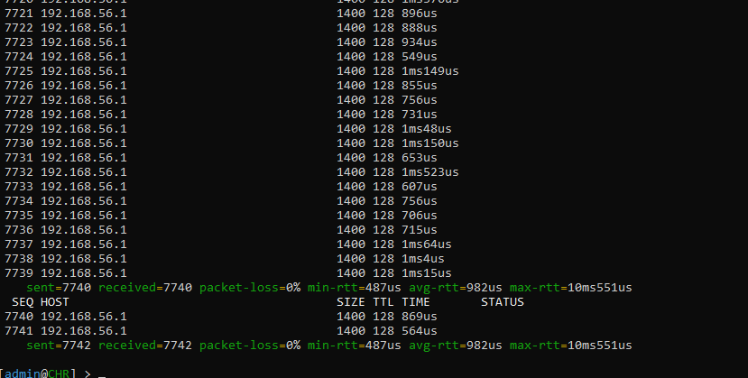
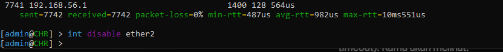

# WiFi Business Network Monitoring System

Hey everyone, welcome to my network engineering portfolio project
I built this project to solve a real problem for small Internet Service Providers (WISPs) and WiFi cafe owners
Most monitoring tools out there are super expensive and complex for small businesses
So I decided to build a cheap, automated, and easy-to-use monitoring stack that runs locally

## What Is This Project For
The main goal of this project is to monitor a network's health in real-time
It tracks how much bandwidth is being consumed, the router's CPU and Memory usage, and system uptime
With this, a business owner can easily see if they are hitting their ISP bandwidth limit or if their router is overloaded
I wanted to make something production-grade but accessible for entry-level setups

## Detailed Network Topology
To make this work without buying expensive hardware, I built a completely virtualized topology
Here is the detailed breakdown of how all the components are connected
- **The Router (MikroTik CHR)**
  Running inside Oracle VirtualBox with an IP address of `192.168.56.103` via a Host-Only adapter
  This acts as our core network device that we want to monitor
- **The Docker Host**
  My physical machine runs Docker Desktop using the WSL2 backend
  It hosts three main containerized services on a dedicated bridge network called `monitoring`
- **SNMP Exporter (Port 9116)**
  This acts as the translator
  It reaches out to the MikroTik router at `192.168.56.103` on UDP port 161 to grab raw SNMP data
- **Prometheus (Port 9090)**
  This is the time-series database engine
  Every 30 seconds, Prometheus scrapes the translated metrics from the SNMP Exporter and stores them securely
- **Grafana (Port 3000)**
  The beautiful frontend dashboard
  It queries the Prometheus database and visualizes the network data in a dark-themed NOC dashboard

## Live Testing: Normal Traffic vs Network Down Simulation
To prove that this monitoring stack is accurate and reactive, I ran a simulation test directly on the router

### Scenario 1: Normal Traffic Generation
First, I needed to generate active traffic so the bandwidth graphs would actually show data
I used the MikroTik terminal to ping the host gateway `192.168.56.1` continuously with large packets
I configured the ping with a size of 1400 bytes to ensure it generates noticeable bandwidth
As you can see in the first image, I successfully sent exactly 7742 requests with 0% packet loss

Because of these 7742 requests flowing through the interface, the WAN bandwidth graph in Grafana spiked up
The dashboard accurately displayed the active download and upload speeds in real-time

### Scenario 2: Simulating a Network Outage
After confirming the normal traffic was being monitored, I wanted to test how the system reacts to a failure
To simulate a physical cable being unplugged or an ISP outage, I went back to the MikroTik console
I intentionally executed the command `int disable ether2` to completely shut down the active interface

The reaction on the monitoring dashboard was instant
Since the interface was disabled, the traffic flow stopped completely and the packets stopped moving
In Grafana, the WAN bandwidth graph plummeted straight down to zero Mbps forming a steep drop
This proves that the SNMP Exporter successfully caught the interface state change
If this was a real WiFi business, the owner would see this drop immediately and know exactly what failed

## How To Run It Yourself
If you want to test my project on your own machine, just follow these steps
1. Make sure you have Docker Desktop and VirtualBox running
2. Start your MikroTik CHR VM, enable SNMP, and check its IP address
3. Update the target IP in `prometheus.yml` to match your router's IP
4. Open a terminal in the project folder
5. Run `docker compose up -d`
6. Open your browser and go to `http://localhost:3000`
7. Log in to Grafana and you will see the dashboard auto-loaded with live data

Thanks for checking out my project
Feel free to reach out if you have any questions or feedback
